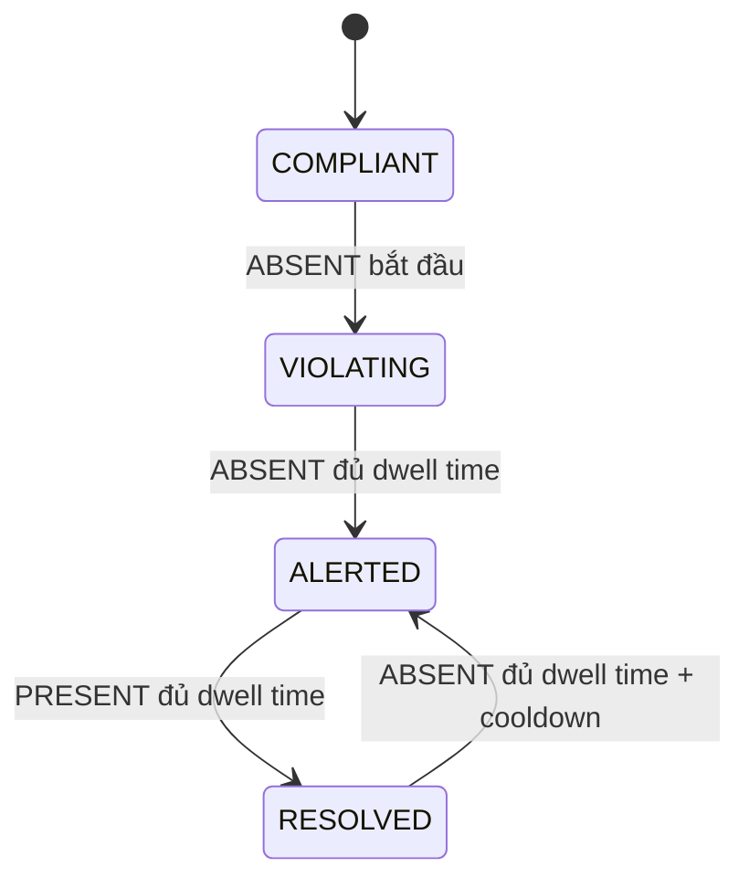

# PPE Safety Monitoring
# PPE Safety Monitoring — Track-centric Event Monitoring

Hệ thống nhận camera/video công trường, phát hiện người, duy trì track, kiểm
tra PPE theo từng người và chỉ phát hành cảnh báo sau khi bằng chứng vi phạm
tồn tại đủ lâu. Kết quả nghiệp vụ là **violation event**, không phải một
bounding box đơn lẻ.

[](https://www.python.org/downloads/)
[](https://docs.ultralytics.com/)
[](tests/)
[](#kiến-trúc)
[](LICENSE)

---

## Kiến trúc

```text
Camera/video
   ↓
Person detection + track update mỗi frame
   ↓
PersonCropBuilder (padding cố định)
   ↓
PPE inspection theo cadence riêng
   ↓
Body-zone association trên person box gốc
   ↓
PRESENT / ABSENT / UNKNOWN
   ↓
Time-based violation FSM (dwell time, cooldown, TTL)
   ↓
Confirmed event + snapshot + JSON/CSV + human review
```

---

## 1. Pipeline Canonical 10 Giai Đoạn (System Lifecycle)

Hệ thống được thiết kế theo vòng đời Machine Learning khép kín, phân tách minh bạch giữa **Offline ML Pipeline** (Huấn luyện & Đánh giá) và **Online Surveillance Pipeline** (Suy luận & Tác nghiệp thời gian thực):

```text
========================================================================================
                                 OFFLINE ML PIPELINE
========================================================================================

1. DATA INGESTION
   Raw Construction Images & Surveillance Video Feeds (Full HD / HD 720p)
          ↓
2. DATA QA & ANTI-LEAKAGE AUDIT
   Exact Duplicate Filter (SHA-256) + Near-Duplicate Filter (pHash Hamming distance)
   Grouping: recording_session; camera/site dùng để kiểm tra domain shift
          ↓
3. GROUP-AWARE SPLIT
   Train (70%) ── Validation (15%) ── Locked Test (15%)
   Locked test dùng camera/site chưa thấy nếu metadata thật đáp ứng điều kiện
          ↓
4. PERSON-CROP GENERATION
   Person Detector → Person ROI + 10px Fixed Padding Contract → Letterbox 640×640
          ↓
5. PPE MODEL TRAINING
   Candidates: YOLOv8n-PPE vs YOLOv8s-PPE (Classes: helmet, no-helmet, vest, no-vest)
   Explicit Augmentation Contract (Mild HSV, Translation, Scale, Horizontal Flip)
          ↓
6. VALIDATION MODEL SELECTION (Pareto Frontier)
   Val mAP50-95 + no-helmet Recall + no-vest Recall + p95 Latency Trade-off
          ↓
   Chỉ chọn champion sau khi có validation metrics thật
          ↓
7. LOCKED FINAL TEST & ARTIFACT VERSIONING
   Detection Metrics + End-to-End System Metrics → Versioned Artifact Registry

========================================================================================
                              ONLINE SURVEILLANCE PIPELINE
========================================================================================

8. PERCEPTION LAYER
   Surveillance Camera Stream / Video File
          ↓
   Person Detector (COCO Class 0, Person Conf: 0.30, NMS IoU: 0.50)
          ↓
   Worker Tracking (tracker được khai báo rõ; baseline hiện tại là IoU hai ngưỡng)
          ↓
   Tracked Person ROIs (crop có padding 10px; track box vẫn là tọa độ gốc)
          ↓
   PPE Detector (PPE Conf: 0.30, 4 classes)
          ↓
   Spatial Body-Zone Association theo runtime policy
          ↓
9. TEMPORAL INTELLIGENCE LAYER
   Per-Track PPE Observation Accumulation
          ↓
   Temporal Violation FSM (Finite State Machine)
   [COMPLIANT] ──(ABSENT đủ dwell time)──> [ALERTED] ──(PRESENT đủ dwell time)──> [RESOLVED]
                                       │
                                       └──> [RECURRENT VIOLATION]
          ↓
10. OPERATIONS & MONITORING LAYER
   Audit Evidence Snapshot + Sound Alert + JSON Summary + CSV Event Logs + Streamlit Dashboard
```

---

## 2. Quyết Định Kiến Trúc Trọng Tâm: Two-Stage Detection

Thay vì huấn luyện một mô hình detector duy nhất phát hiện toàn bộ trang bị bảo hộ trên khung hình lớn, nền tảng lựa chọn kiến trúc **Two-Stage Detection**:
1. **Khắc phục độ lệch kích thước vật thể (Scale Invariance)**: Trang bị bảo hộ (mũ, áo) chiếm tỷ lệ rất nhỏ trên ảnh camera công trường góc rộng ($1920 \times 1080$). Việc phát hiện người trước rồi cắt ROI giúp chuẩn hóa kích thước PPE tương đối lớn hơn đáng kể trong không gian đặc trưng.
2. **Gắn chặt trạng thái an toàn theo từng cá nhân (Per-Worker PPE Attribution)**: Việc chạy detector trực tiếp trên toàn khung hình rất khó gán chính xác chiếc mũ thuộc về ai khi nhiều công nhân đứng gần nhau. Stage-2 cho phép quản lý trạng thái tuân thủ gắn liền với định danh của từng người.
3. **Liên kết không gian giải phẫu (Spatial Body-Zone Association)**: Giảm lỗi gán nhầm trong cảnh đông người (Crowded Scenes):
   - Mũ (`helmet`, `no-helmet`) bắt buộc phải nằm ở vùng đầu ($y \le 35\%$ ROI).
   - Áo (`vest`, `no-vest`) bắt buộc phải nằm ở vùng thân giữa ($30\% \le y \le 75\%$ ROI).
   - Fixed geometry không loại bỏ hoàn toàn cross-person contamination; đây là một bộ lọc giảm rủi ro.

---

## 3. Phân Tách 3 Bài Toán Riêng Biệt & Hệ Đo Lường Độc Lập

Một sai lầm phổ biến là dùng chỉ số **PPE mAP** để đại diện cho *"Độ chính xác cảnh báo an toàn của hệ thống"*. Nền tảng phân định rạch ròi 3 bài toán với ma trận chỉ số độc lập:

| Bài toán | Tên bài toán | Đối tượng xử lý | Chỉ số đánh giá cốt lõi | Ý nghĩa thực tế |
| :--- | :--- | :--- | :--- | :--- |
| **Problem A** | **Person Detection** | Khung hình gốc Full HD | Precision, Recall, mAP50, mAP50-95 | Ngưỡng chặn trên: $SystemRecall \le PersonRecall$. Bỏ sót người thì PPE không bao giờ được chạy. |
| **Problem B** | **PPE Recognition** | Vùng ảnh cắt Person ROI | mAP50, mAP50-95, per-class Recall (`no-helmet`, `no-vest`) | Đánh giá năng lực thị giác máy tính nhận biết mũ và áo trong điều kiện ánh sáng/góc nhìn khác nhau. |
| **Problem C** | **Violation Event Detection** | Chuỗi quan sát thời gian (Temporal Stream) | **Event Precision, Event Recall, False Alerts/Hour, Time-to-Alert** | **Chỉ số nghiệp vụ sống còn**: Hệ thống có cảnh báo đúng vi phạm không? Có bị báo động giả gây ô nhiễm không? |

---

## 4. Hợp Đồng Cấu Hình Phân Tách (Decoupled Architecture Contracts)

Các cấu hình hệ thống được tách rời thành 4 hợp đồng kỹ thuật chuẩn tại thư mục `configs/`:

```text
configs/
├── dataset_v1.yaml        # DATA CONTRACT: Annotation semantics, crop padding, group split protocol
├── train_yolov8n.yaml     # TRAINING CONTRACT: Hyperparameters, lr0, lrf, optimizer, augmentations
├── train_yolov8s.yaml     # CANDIDATE CONTRACT: High-capacity comparative model
└── runtime_policy.yaml    # INFERENCE & DECISION CONTRACT: Thresholds, FSM rules, body-zone ratios
```

*Toàn bộ siêu tham số trong `train_yolov8n.yaml` (optimizer `AdamW`, `lr0=0.01`, `lrf=0.01`, augmentations) được chuyển tiếp thực tế vào Ultralytics `model.train()` mà không có tham số chết.*

---

## 5. Dữ liệu và chống rò rỉ

Repo không chứa dataset ảnh/video thật. Không có con số mẫu, camera, phân phối
lớp hay benchmark nào được coi là measured nếu chưa xuất hiện trong artifact
được tạo từ dữ liệu thật.

Quy trình chuẩn:

```text
metadata CSV + ảnh/label thật
    → training/build_manifest.py
    → SHA-256 bytes ảnh + pHash ảnh đã decode
    → split theo recording_session; kiểm tra camera/site cho domain shift
    → audit_dataset.py
    → PersonCropBuilder (chỉ tạo crop sau split)
```

Manifest phải có provenance, `frame_id`, `timestamp_ms`, đường dẫn ảnh/label,
`file_sha256`, `image_phash`, `split` và `annotation_version`. Audit sẽ lỗi nếu
session bị chia chéo, file thiếu hoặc SHA không khớp. `training/dataset_card.md`
mô tả đầy đủ hợp đồng này.

---

## 6. Tri-state và FSM theo thời gian

Mỗi track có state độc lập cho helmet và vest:

```text
PRESENT  → bằng chứng tuân thủ
ABSENT   → bằng chứng vi phạm
UNKNOWN  → chưa đủ bằng chứng; không được coi là PRESENT
```

`UNKNOWN` không tăng bộ đếm vi phạm, không tăng bộ đếm tuân thủ và không reset
event đang mở. Vi phạm chỉ trở thành event khi `ABSENT` kéo dài đủ
`violation_confirm_seconds`; khắc phục cần `resolution_confirm_seconds`.

FSM cũng thực thi `alert_cooldown_seconds` và dọn state theo
`track_ttl_seconds`.



---

## 7. Đánh giá và bằng chứng

Evaluator production không có số mặc định. Thiếu weights, annotation, locked
test, trajectory hoặc duration sẽ làm lệnh lỗi. Demo synthetic được tách ở
`scripts/demo_pipeline.py` và luôn ghi `synthetic_demo=true`.

Metric headline của hệ thống:

| Tầng | Metric |
| :--- | :--- |
| Person | Precision, Recall, mAP50, mAP50-95 |
| PPE | mAP50-95, no-helmet Recall, no-vest Recall |
| PPE state | Macro-F1 từng state, UNKNOWN rate |
| Tracking | IDF1, ID switches, fragmentation, MOTA |
| Event | Precision, Recall, False Alerts/hour, Time-to-Alert |
| Runtime | p50/p95 latency, processed FPS, input FPS |

PPE model được đánh giá trên person crop chuẩn hóa; end-to-end test chạy full
video qua person detector → tracker → crop → PPE → event. Validation dùng để
chọn model/policy; locked test chỉ dùng report sau khi mọi artifact đã freeze.

---

## 8. Cấu Trúc Mã Nguồn

```text
deep-learning-application/
├── configs/                             # HỢP ĐỒNG CẤU HÌNH HỆ THỐNG
│   ├── dataset_v1.yaml                  # Data & Annotation contract
│   ├── train_yolov8n.yaml               # Training contract cho YOLOv8n
│   ├── train_yolov8s.yaml               # Training contract cho YOLOv8s
│   └── runtime_policy.yaml              # Runtime policy & decision rules
├── ppe_detection/                       # SURVEILLANCE RUNTIME ENGINE
│   ├── config.py                        # Quản lý cấu hình & validation
│   ├── models.py                        # PPEState tri-state, detection và violation state
│   ├── crops.py                         # PersonCropBuilder dùng chung train/serve
│   ├── detector.py                      # Two-Stage detector & body-zone association
│   ├── tracker.py                       # TwoThresholdIoUTracker và IoU baseline
│   ├── violation_fsm.py                 # Dwell time, cooldown và TTL
│   ├── pipeline.py                      # Điều phối luồng xử lý Track-First
│   ├── reporting.py                     # Báo cáo JSON thống kê & CSV sự kiện
│   ├── service.py                       # Service layer phân tách session
│   └── visualization.py                 # HUD, HUD overlay và Bounding Box
├── training/                            # OFFLINE ML LIFECYCLE
│   ├── build_manifest.py                # Manifest từ ảnh/annotation thật
│   ├── build_person_crops.py             # Crop người sau khi khóa split
│   ├── audit_dataset.py                 # Kiểm tra file, hash và group split
│   ├── dataset_card.md                  # Dataset Card chuẩn quốc tế
│   ├── train.py                         # Huấn luyện YOLO nhận đầy đủ tham số contract
│   ├── evaluate_detector.py             # Đánh giá Layer 1 (PPE) & Layer 2 (Person)
│   ├── evaluate_tracking.py             # Đánh giá Layer 3 (Tracking: ID switches, IDF1)
│   ├── evaluate_events.py               # Đánh giá Layer 4 (Violation events matching)
│   ├── evaluate_system.py               # Tổng hợp từ artifacts, không hard-code
│   ├── evaluate.py                      # Điểm truy cập đánh giá hợp nhất
│   └── export.py                        # Xuất mô hình ONNX / TensorRT
├── scripts/                             # Entry points demo và final evaluation
│   ├── demo_pipeline.py
│   └── evaluate_final.py
├── tests/                               # Kiểm thử tự động
│   ├── test_config.py
│   ├── test_edge_cases.py
│   ├── test_pipeline.py
│   ├── test_reporting.py
│   ├── test_tracker.py
│   ├── test_training_contracts.py       # Kiểm tra forwarding tham số & anti-leakage
│   ├── test_spatial_association.py      # Kiểm tra body zone & lưu box PPE
│   ├── test_violation_fsm.py            # Kiểm tra FSM, resolution & recurrence
│   ├── test_tracking_time_semantics.py  # Kiểm tra tracker hai ngưỡng & motion prediction
│   └── test_event_evaluation.py         # Kiểm tra matching sự kiện không phụ thuộc ID
├── app.py                               # CLI Entrypoint
├── web_app.py                           # Web Dashboard tương tác Streamlit
├── requirements.txt
└── pytest.ini
```

---

## 9. Hướng Dẫn Cài Đặt & Sử Dụng

### Cài đặt môi trường

```bash
git clone <repository-url>
cd deep-learning-application
python -m venv .venv

# Windows PowerShell:
.venv\Scripts\Activate.ps1
# Linux/macOS:
source .venv/bin/activate

pip install --upgrade pip
pip install -r requirements.txt
```

### 1. Chạy demo synthetic

Chế độ demo chạy trực tiếp mà không cần tải trước weights:

```bash
# Demo được tách khỏi đường chạy model/evaluation thật
python scripts/demo_pipeline.py

# Hoặc chạy trực tiếp CLI demo trên ảnh
python app.py --demo --source tests/sample.jpg --save --no-display

# Chạy Dashboard Streamlit
streamlit run web_app.py
```

### 2. Xây và kiểm toán manifest thật

```bash
# metadata.csv phải do người thu thập cung cấp và split ở cấp session
python training/build_manifest.py --metadata data/raw/metadata.csv --output data/manifests/dataset.csv
python training/audit_dataset.py --manifest data/manifests/dataset.csv --output reports/dataset_audit.json
# Sau khi bổ sung person_x1..person_y2 vào manifest đã audit:
python training/build_person_crops.py --manifest data/manifests/person_dataset.csv --output-dir data/crops
```

### 3. Đánh giá locked test thật

```bash
python scripts/evaluate_final.py \
  --ppe-model releases/ppe-monitor-v1.0.0/ppe_detector.pt \
  --person-model releases/ppe-monitor-v1.0.0/person_detector.pt \
  --data training/data.yaml \
  --gt-tracks reports/gt_tracks.json \
  --pred-tracks reports/pred_tracks.json \
  --gt-events reports/gt_events.json \
  --pred-events reports/pred_events.json \
  --gt-to-pred-map reports/gt_to_pred_track_id.json \
  --duration-hours 1.0
```

`--gt-to-pred-map` là ánh xạ identity sinh từ bước đánh giá tracking; có thể
bỏ qua chỉ khi GT và prediction dùng cùng hệ ID.

```bash
# Chạy kiểm thử tự động
python -m pytest -v
```

### 4. Huấn luyện mô hình bằng Training Contract

```bash
python training/train.py --config configs/train_yolov8n.yaml
```

### 5. Vận hành với model thật

```bash
# CLI đọc configs/runtime_policy.yaml làm source of truth
python app.py --source 0 --person-model models/yolov8n.pt --ppe-model models/best.pt --save

# Chạy với Video file
python app.py --source data/surveillance.mp4 --person-model models/yolov8n.pt --ppe-model models/best.pt --save
```

---

## 10. Giới Hạn Kiến Trúc & Lộ Trình Phát Triển (Prioritized Roadmap)

### Giới hạn hiện tại (Failure Modes)
- **Extreme Crowd / Occlusion**: Khi công nhân bị che khuất $>70\%$, Person Detector có thể miss dẫn đến PPE Detector không được kích hoạt.
- **Lighting Extremes**: Bối cảnh ban đêm hoặc ngược sáng mạnh làm suy giảm độ chính xác của lớp áo phản quang không phát quang.
- **Camera Calibration**: Tỷ lệ phân vùng giải phẫu cơ thể ($35\%$ và $75\%$) hiện giả định góc quay ngang hoặc nghiêng vừa phải (diagonal angle); góc camera từ trên đỉnh đầu chiếu thẳng xuống (top-down bird's-eye view) cần ma trận chiếu riêng.

### Lộ trình ưu tiên
- [x] P0: Runtime policy được nạp đầy đủ; thiếu model/policy thì fail closed.
- [x] P0: PPE state là PRESENT/ABSENT/UNKNOWN; FSM dùng dwell time, cooldown và TTL.
- [x] P0: Bỏ manifest tổng hợp và benchmark hard-code khỏi production story.
- [x] P1: Hash ảnh thật, split theo session trước crop và evaluator interval event.
- [ ] P1: Tích hợp implementation ByteTrack chuẩn và tracking annotations thật.
- [ ] P1: Bổ sung locked test, benchmark person/PPE/event/runtime từ dữ liệu thật.
- [ ] P2: Release bundle bất biến, hash model/policy/dataset và startup integrity gate.
- [ ] P2: SQLite event/review workflow và retention policy cho evidence.
- [ ] P3: Monitoring camera health, UNKNOWN rate và drift theo camera/site.

---

## Giấy Phép (License)

Mã nguồn được phân phối dưới giấy phép [MIT License](LICENSE).
Mô hình YOLOv8 tuân theo chính sách cấp phép của Ultralytics.
