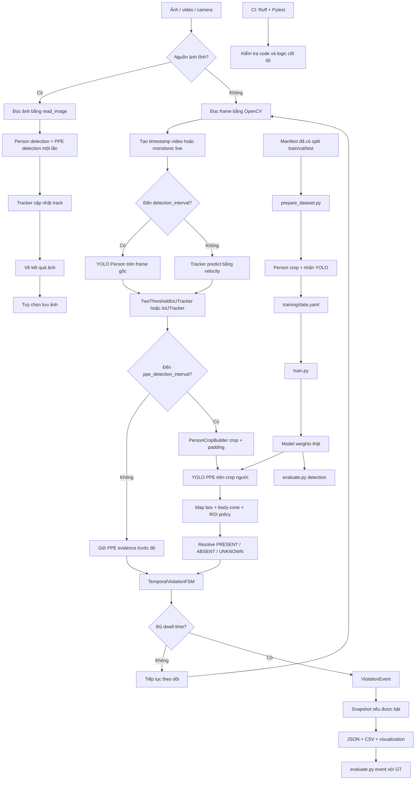

# PPE Safety Monitoring

[](https://github.com/haminhthong/PPE-Safety-Monitoring/actions/workflows/ci.yml)
[](https://www.python.org/)
[](https://pytorch.org/)
[](https://docs.ultralytics.com/)
[](https://opencv.org/)
[](https://streamlit.io/)
[](https://docs.pytest.org/)
[](https://docs.astral.sh/ruff/)
[](LICENSE)

Hệ thống Computer Vision giám sát việc tuân thủ trang bị bảo hộ cá nhân (PPE)
trên ảnh, video và nguồn camera. Kết quả nghiệp vụ của hệ thống là sự kiện vi
phạm theo thời gian, gắn với `track_id`, timestamp và ảnh bằng chứng; không chỉ
là một bounding box xuất hiện ở một frame đơn lẻ.

PPE hiện được mô hình hóa bằng bốn nhãn: `helmet`, `no-helmet`, `vest` và
`no-vest`. Hệ thống dùng hai model YOLO độc lập: một model phát hiện người trên
frame gốc và một model phát hiện PPE trên crop của từng người.

> Repository không chứa dataset thật hoặc model weights. Các lệnh chạy model
> thật, training, benchmark và evaluation chỉ hoạt động sau khi người dùng cung
> cấp các artifact đúng đường dẫn.

## Bài toán & Phạm vi ứng dụng (Problem & Scope)

### Bài toán

Trong công trường hoặc nhà máy, detector theo từng frame có thể bị nhấp nháy
khi người bị che khuất, cúi đầu, quay lưng hoặc đứng gần người khác. Hệ thống
giải quyết hai rủi ro chính:

1. Giảm false alert do một hoặc vài frame nhận diện sai bằng tracking và FSM
   xác nhận theo thời gian.
2. Giảm gán nhầm PPE giữa nhiều người bằng crop theo từng person box, body-zone
   và quy tắc ROI.

Đơn vị kết quả chuẩn là:

```text
frame -> person detection -> track -> person crop -> PPE state
      -> temporal FSM -> confirmed violation event -> report/snapshot
```

### Trong phạm vi

- Ảnh tĩnh để phát hiện, vẽ kết quả và kiểm tra wiring của pipeline; ảnh tĩnh
  không chạy vòng FSM để phát sinh violation event.
- Video file, webcam index và URI camera mà OpenCV hỗ trợ.
- Person detection bằng class `0` của model YOLO trên frame gốc.
- PPE detection trên crop người với bốn class trong `training/data.yaml`.
- Two-stage inference, body-zone head/torso và ROI polygon tùy chọn.
- `TwoThresholdIoUTracker` hoặc `IoUTracker`.
- Dwell time, thời gian khắc phục, cooldown và track TTL.
- Snapshot, JSON/CSV report, CLI, Streamlit dashboard và Docker image.
- Chuẩn bị person crop, training YOLO, detection evaluation, event evaluation
  và benchmark video.

### Ngoài phạm vi hiện tại

- Tracker là baseline IoU nội bộ, chưa phải implementation ByteTrack chuẩn.
- Không có multi-camera worker pool, async queue, API backend, database review,
  authentication hoặc object storage.
- Không nhận dạng danh tính, face recognition hoặc tự động retrain online.
- Không có benchmark production trong repository vì không có dataset/weights
  thật.
- Body-zone và ROI chỉ là bộ lọc không gian; không bảo đảm loại bỏ mọi lỗi
  cross-person trong cảnh bị che khuất mạnh.

## Quy trình kỹ thuật duy nhất

Sơ đồ dưới đây là quy trình chuẩn duy nhất chi phối runtime, cấu hình, chuẩn bị
dữ liệu, báo cáo và kiểm thử. `configs/config.yaml` điều khiển runtime; model,
dataset và ground truth thật được truyền rõ khi training/evaluation.



## Luồng logic runtime

### 1. Nạp cấu hình

`app.py`, `web_app.py` và `scripts/benchmark_video.py` đều dùng
`DetectionConfig.load_from_yaml()`. File mặc định là
`configs/config.yaml`. CLI hoặc dashboard có thể override một số trường như
model path, confidence, PPE interval, output và hiển thị.

`configs/config.yaml` chứa các nhóm:

- `model`: `image_size`, confidence của person/PPE và `nms_iou`.
- `tracking`: loại tracker, ngưỡng IoU, `max_missed` và `track_ttl_seconds`.
- `ppe`: interval kiểm tra PPE, crop padding và head/torso zone.
- `alert`: dwell, resolve, cooldown, conflict margin và ROI policy.
- `output`: thư mục lưu, snapshot, cửa sổ OpenCV và beep.

Model path không được khai báo sẵn trong file cấu hình mẫu. CLI nhận qua
`--person-model` và `--ppe-model`; dashboard nhập qua sidebar; benchmark nhận
qua hai tham số bắt buộc.

### 2. Person detection và tracking

- Trên frame detection, `DualModelDetector.detect_persons()` chỉ giữ class `0`
  của model person.
- ROI polygon được áp dụng theo `center`, `overlap` hoặc `center_or_overlap`.
- `TwoThresholdIoUTracker` ghép detection confidence cao trước, sau đó dùng
  detection confidence thấp để khôi phục track chưa ghép.
- Khi không đến chu kỳ person detection, pipeline gọi `tracker.predict()` để
  nội suy box theo velocity.
- Track bị xóa khi vượt `max_missed` hoặc quá `track_ttl_seconds`.

### 3. Person crop và PPE association

`PersonCropBuilder` dùng chung contract cho serving và training. Crop có padding,
bị clip vào kích thước frame và trả về `CropWindow` để map box PPE về hệ tọa độ
person gốc.

`validate_body_zone()` mặc định chấp nhận:

- `helmet`/`no-helmet`: tâm box trong `0.00..0.35` chiều cao person.
- `vest`/`no-vest`: tâm box trong `0.30..0.75` chiều cao person.

Các giới hạn này là cấu hình, không phải hằng số bắt buộc.

### 4. Tri-state và FSM

Mỗi loại PPE có một trong ba trạng thái:

- `PRESENT`: điểm PPE dương vượt confidence và thắng nhãn đối nghịch theo
  `conflict_margin`.
- `ABSENT`: nhãn `no-helmet` hoặc `no-vest` đủ mạnh và thắng nhãn dương.
- `UNKNOWN`: thiếu bằng chứng hoặc hai phía xung đột.

`UNKNOWN` không được tự động xem là tuân thủ, không tăng bằng chứng vi phạm và
không reset một trạng thái vi phạm đang chờ xác nhận.

FSM theo thứ tự:

```text
COMPLIANT
  -- ABSENT đủ violation_seconds --> ALERTED + event
  -- ABSENT chưa đủ thời gian --> VIOLATING
  -- PRESENT đủ resolution_seconds sau ALERTED --> RESOLVED
  -- ABSENT sau RESOLVED và hết cooldown --> ALERTED + recurrence event
```

Trong cooldown, tái phạm chỉ giữ trạng thái chờ; không phát cảnh báo spam.
Mỗi event có `event_start_seconds` và `alert_time_seconds`.

### 5. Nguồn dữ liệu và timestamp

- Video file ưu tiên timestamp `CAP_PROP_POS_MSEC`, fallback về frame index/FPS.
- Webcam và URI live (`rtsp`, `rtmp`, `http`, `https`) dùng `monotonic clock`.
- Ảnh tĩnh dùng timestamp `0.0` và không đi qua `_evaluate_fsm()`.

## Luồng dữ liệu training và evaluation

### Manifest và person crop

`training/prepare_dataset.py` nhận manifest CSV đã có các cột:

```text
image_path,label_path,person_x1,person_y1,person_x2,person_y2,split
```

`split` phải là `train`, `val` hoặc `test`. File phải được chia group theo video
hoặc recording session từ trước; module có hàm `group_split_by_video()` để dùng
ở bước chuẩn bị riêng, nhưng CLI hiện tại sử dụng giá trị `split` có sẵn trong
manifest và không tự gọi hàm đó.

Script đọc ảnh gốc, crop person, cắt/ánh xạ nhãn PPE YOLO về crop rồi ghi:

```text
data/dataset_ppe/
├── train/images/ và train/labels/
├── val/images/   và val/labels/
└── test/images/  và test/labels/
```

`training/data.yaml` trỏ trực tiếp đến ba thư mục `*/images` ở trên; đây là
contract khớp với output thực tế của `prepare_dataset.py`.

### Training

`training/train.py` dùng Ultralytics YOLO và ghi metadata môi trường vào
`runs/train/<experiment_name>/`, gồm `experiment_env.json` và
`resolved_config.yaml`.

```bash
python training/prepare_dataset.py \
  --manifest data/manifest.csv \
  --output-dir data/dataset_ppe \
  --data-yaml training/data.yaml

python training/train.py \
  --data training/data.yaml \
  --model yolov8n.pt \
  --epochs 50 \
  --batch 16 \
  --imgsz 640
```

Có thể truyền một YAML tùy chọn bằng `--config`; các khóa được đọc gồm
`experiment_name`, `data`, `model_type`, `epochs`, `imgsz`, `batch`, `seed`,
`device` và một số optimizer option.

### Evaluation

Detection evaluation yêu cầu model và dataset thật:

```bash
python training/evaluate.py \
  --task detection \
  --model models/best.pt \
  --data training/data.yaml \
  --split test \
  --output runs/eval_detection.json
```

Event evaluation đọc hai JSON dạng danh sách. Mỗi event cần tối thiểu
`track_id`, `violation_type` và thời gian; GT có thể dùng `start_sec`/`end_sec`,
còn prediction có thể dùng `alert_time_seconds` hoặc `time_seconds`.

```bash
python training/evaluate.py \
  --task event \
  --gt-events data/gt_events.json \
  --pred-events outputs/pred_events.json \
  --duration-hours 1.5 \
  --output runs/eval_events.json
```

Event evaluator tính event precision, recall, F1, false alerts/hour và median
time-to-alert. Ghép event yêu cầu đúng `track_id` (hoặc mapping được truyền khi
gọi hàm Python), đúng loại vi phạm và timestamp nằm trong khoảng GT cộng
`time_tolerance_sec`.

### Export và benchmark

```bash
python training/export.py \
  --weights models/best.pt \
  --format onnx \
  --img-size 640

python scripts/benchmark_video.py \
  --video data/surveillance.mp4 \
  --config configs/config.yaml \
  --person-model models/yolov8n.pt \
  --ppe-model models/best.pt
```

Benchmark đo số frame xử lý, FPS, latency trung bình, số worker và số event.
Hai model là bắt buộc vì `configs/config.yaml` không chứa đường dẫn weights.

## Cấu trúc thư mục dự án

```text
PPE-Safety-Monitoring/
├── configs/
│   └── config.yaml                 # Cấu hình runtime duy nhất
├── ppe_detection/
│   ├── config.py                   # DetectionConfig và YAML loader
│   ├── crops.py                    # PersonCropBuilder, CropWindow
│   ├── detector.py                 # YOLO hai giai đoạn, ROI, body-zone
│   ├── models.py                   # Detection, PPE state, violation state
│   ├── pipeline.py                 # Pipeline ảnh/video/camera
│   ├── reporting.py                # Event và JSON/CSV report
│   ├── service.py                  # Session output theo UUID
│   ├── tracker.py                  # IoU tracker và motion prediction
│   ├── violation_fsm.py             # Dwell/resolve/cooldown FSM
│   └── visualization.py             # Box, nhãn, ROI và HUD
├── training/
│   ├── data.yaml                   # PPE dataset contract
│   ├── prepare_dataset.py          # Crop person và tạo data.yaml
│   ├── train.py                    # Huấn luyện YOLO
│   ├── evaluate.py                 # Detection/event evaluation
│   └── export.py                   # Export ONNX/engine/TorchScript
├── scripts/
│   └── benchmark_video.py          # Benchmark video với model thật
├── tests/
│   ├── conftest.py                 # MockDetector fixture
│   ├── test_config.py              # YAML và validation
│   ├── test_fsm.py                 # Temporal FSM
│   ├── test_pipeline.py            # Pipeline ảnh
│   ├── test_reporting.py            # JSON/CSV report
│   ├── test_spatial.py             # ROI/body-zone
│   └── test_tracker.py              # IoU, ID, prediction
├── app.py                          # CLI entry point
├── web_app.py                      # Streamlit dashboard
├── Dockerfile                      # Image chạy dashboard
├── requirements.txt                # Runtime dependencies
├── requirements-dev.txt            # Runtime + test/lint dependencies
└── pyproject.toml                  # Ruff và Pytest configuration
```

## Cài đặt và chạy thử nghiệm

### Windows PowerShell

```powershell
git clone https://github.com/haminhthong/PPE-Safety-Monitoring.git
Set-Location PPE-Safety-Monitoring
py -3.11 -m venv .venv
.\.venv\Scripts\Activate.ps1
python -m pip install --upgrade pip
python -m pip install -r requirements-dev.txt
```

### Linux/macOS

```bash
git clone https://github.com/haminhthong/PPE-Safety-Monitoring.git
cd PPE-Safety-Monitoring
python3.11 -m venv .venv
source .venv/bin/activate
python -m pip install --upgrade pip
python -m pip install -r requirements-dev.txt
```

### Chạy CLI với model thật

CLI không tự chuyển sang demo và sẽ dừng nếu thiếu một trong hai model.

```bash
python app.py \
  --source data/surveillance.mp4 \
  --config configs/config.yaml \
  --person-model models/yolov8n.pt \
  --ppe-model models/best.pt \
  --save \
  --no-display
```

Các input thường dùng:

```bash
# Webcam index 0
python app.py --source 0 --person-model models/yolov8n.pt --ppe-model models/best.pt

# Ảnh tĩnh; chỉ lưu ảnh annotated, không phát violation event
python app.py --source tests/sample.jpg \
  --person-model models/yolov8n.pt --ppe-model models/best.pt \
  --save --no-display
```

Các override CLI hiện có: `--img-size`, `--person-conf`, `--ppe-conf`,
`--output-dir`, `--no-snapshots`, `--no-display` và `--no-beep`.

Khi bật `--save`, `DetectionService` tạo session riêng:

```text
outputs/<YYYYMMDD_HHMMSS_UUID>/
├── <source>_detected.jpg hoặc <source>_detected.mp4
├── <source>_report.json
├── <source>_events.csv
└── snapshots/violation_id*_*.jpg
```

Snapshot chỉ được ghi khi đồng thời bật `save_output` và `save_snapshots`.

### Streamlit

```bash
streamlit run web_app.py
```

Dashboard mở tại `http://localhost:8501`. Người dùng tải ảnh/video, nhập hai
đường dẫn model và điều chỉnh confidence, PPE interval, dwell, resolve và
snapshot. File upload tối đa 200 MB và file tạm được xóa sau phiên xử lý.

### Docker

```bash
docker build -t ppe-monitoring .
docker run --rm -p 8501:8501 ppe-monitoring
```

Container chỉ cài runtime dependencies và khởi chạy Streamlit. Model weights
không được copy sẵn vào image; cần mount/copy artifact model phù hợp trước khi
chạy phân tích thật.

## Kiểm thử và CI

Chạy local các gate đúng với workflow `.github/workflows/ci.yml`:

```bash
python -m ruff check .
python -m pytest
```

CI chạy trên Ubuntu với Python 3.11, cài `libgl1` và `libglib2.0-0` cho OpenCV,
sau đó cài `requirements-dev.txt`, chạy Ruff và Pytest. Pytest dùng cấu hình
trong `pyproject.toml`, test path là `tests/` và cache provider bị tắt.

Test không tải model hoặc dataset thật; fixture `MockDetector` kiểm tra pipeline,
tracker, FSM, ROI/body-zone, config và reporting độc lập với weights.

## Báo cáo và giới hạn số liệu

JSON report của mỗi session gồm:

```json
{
  "source": "data/surveillance.mp4",
  "total_frames": 1200,
  "unique_people_tracked": 4,
  "ppe_observations": 300,
  "unknown_ppe_observations": 12,
  "resolved_config": {},
  "violations_summary": {
    "total": 1,
    "helmet": 1,
    "vest": 0,
    "people": 1
  },
  "events": [
    {
      "track_id": 7,
      "violation_type": "helmet",
      "frame_id": 120,
      "time_seconds": 4.0,
      "event_start_seconds": 3.5,
      "alert_time_seconds": 4.0,
      "detected_at": "2026-01-01T10:00:00+07:00",
      "snapshot_path": "snapshots/violation_id7_helmet_frame120_...jpg"
    }
  ]
}
```

Đây là schema theo `SessionReport.save()`. `unknown_ppe_observations` là số
quan sát chưa đủ bằng chứng; UNKNOWN không được cộng vào violation summary.
KPI production chỉ được công bố khi có dataset, weights và ground truth thật.

## Tính sạch và giới hạn của repository

- Không commit model weights, dataset, output, runs hoặc cache.
- Model path được truyền qua CLI/UI/benchmark, không hard-code vào source.
- `training/data.yaml` và `prepare_dataset.py` dùng cùng một contract thư mục.
- Không có file `configs/train_yolov8n.yaml`; training dùng tham số CLI hoặc
  YAML tùy chọn truyền qua `--config`.
- `README.md` là tài liệu hướng dẫn chính; hai file DOCX trong `docs/` là tài
  liệu thuyết minh riêng, không phải file cấu hình runtime.

## Giấy phép

Mã nguồn dùng [MIT License](LICENSE). Ultralytics, PyTorch, OpenCV, Streamlit và
các dependency khác tuân theo giấy phép tương ứng của từng dự án.
