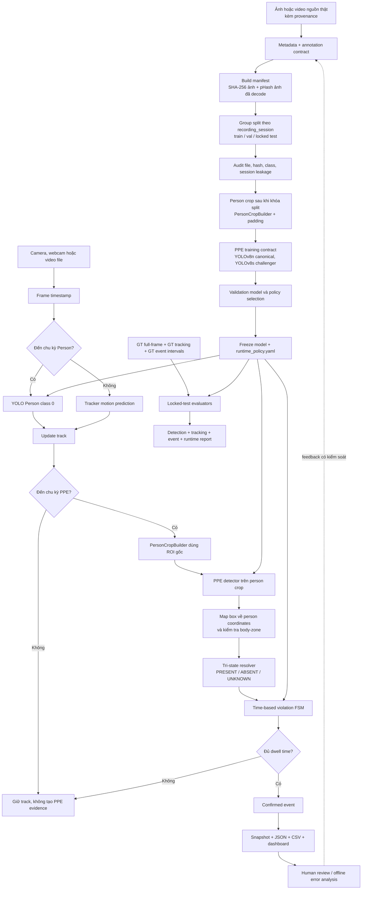
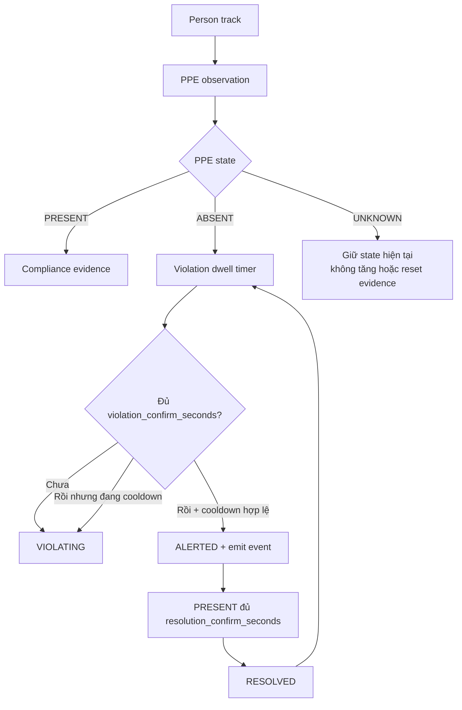

# PPE Safety Monitoring

[](https://github.com/haminhthong/PPE-Safety-Monitoring/actions/workflows/ci.yml)
[](https://www.python.org/)
[](https://pytorch.org/)
[](https://docs.ultralytics.com/)
[](https://opencv.org/)
[](https://streamlit.io/)
[](https://docs.pytest.org/)
[](https://docs.astral.sh/ruff/)
[](LICENSE)

Hệ thống giám sát tuân thủ trang bị bảo hộ cá nhân (PPE) trên ảnh, video và
nguồn camera. Kết quả nghiệp vụ của hệ thống là một violation event có bằng
chứng theo thời gian, không phải một bounding box no-helmet xuất hiện ở một
frame đơn lẻ.

PPE hiện tại gồm bốn lớp: helmet, no-helmet, vest và no-vest.

Runtime dùng kiến trúc hai giai đoạn: phát hiện người trên frame gốc, duy trì
track người, cắt person ROI theo hợp đồng chung, nhận diện PPE trong ROI, giải
quyết trạng thái PRESENT / ABSENT / UNKNOWN, rồi xác nhận vi phạm bằng FSM theo
thời gian.

> Repo không chứa dataset ảnh/video thật hoặc model weights. Mọi metric production
> phải được tạo từ artifact thật; số liệu của demo synthetic không phải benchmark.

## Bài toán & Phạm vi ứng dụng (Problem & Scope)

### Bài toán

Trong công trường hoặc nhà máy, người giám sát cần biết:

1. Người nào đang ở vùng cần kiểm soát.
2. Người đó có đội mũ và mặc áo phản quang hay chưa.
3. Vi phạm có kéo dài đủ lâu để cần cảnh báo hay chỉ là lỗi nhận diện tạm thời.
4. Cảnh báo nào có snapshot và timestamp để người phụ trách kiểm tra lại.

Đơn vị kết quả chuẩn là:

worker track -> PPE state -> confirmed violation event

Một quan sát PPE chỉ có giá trị khi gắn với track_id, thời điểm và chính sách
không gian/thời gian đang được resolve.

### Trong phạm vi

- Ảnh tĩnh để kiểm tra và vẽ kết quả; ảnh tĩnh không tạo violation event.
- Video file, webcam index và URI camera mà OpenCV hỗ trợ.
- Person detection bằng YOLO class 0 trên frame gốc.
- PPE detection trên person crop với bốn class PPE.
- ROI tùy chọn và body-zone cho helmet/vest.
- Tracker baseline nội bộ: TwoThresholdIoUTracker hoặc IoUTracker.
- Dwell time để xác nhận vi phạm và khắc phục.
- Snapshot, báo cáo JSON/CSV, CLI và Streamlit dashboard.
- Manifest ảnh thật, audit hash, group split và tạo person crop sau split.

### Ngoài phạm vi phiên bản này

- Chưa phải implementation ByteTrack chuẩn; tên ByteTrack chỉ còn là alias
  tương thích ngược, còn policy production dùng two_threshold_iou.
- Chưa có async queue, multi-camera worker pool, API backend, SQLite review,
  authentication, object storage hoặc release bundle bất biến.
- Chưa có benchmark production vì repo không có dữ liệu và weights thật.
- Không nhận dạng danh tính, face recognition hoặc tự động retrain online.
- Fixed body-zone chỉ giảm lỗi gán nhầm trong cảnh đông người, không bảo đảm
  loại bỏ hoàn toàn cross-person contamination.
- Mũ cầm trên tay, che khuất mạnh, người quá nhỏ, camera rung hoặc góc top-down
  cần dữ liệu và policy riêng để đánh giá.

### KPI thiết kế, chưa phải số đo

| Chỉ số | Mục tiêu ban đầu | Artifact dùng để đo |
| --- | ---: | --- |
| Recall no-helmet | >= 90% | PPE locked-test report |
| Recall no-vest | >= 85% | PPE locked-test report |
| Event precision | >= 85% | Event interval report |
| False alerts | <= 2/giờ/camera | Video có ground truth |
| Time-to-alert | <= 2 giây | GT interval và alert timestamp |
| Throughput | >= 20 FPS GPU, >= 5 FPS CPU | Benchmark đúng phần cứng |

Không được ghi các KPI này là kết quả đạt được nếu chưa có report thật.

## Quy trình kỹ thuật duy nhất chi phối toàn bộ dự án

Đây là pipeline chuẩn mà README, cấu hình, mã nguồn, training và báo cáo phải
cùng tuân theo. Nhánh Offline tạo artifact; nhánh Online dùng model/policy đã
resolve; nhánh Evaluation chỉ đọc artifact thật và không tự sinh metric.



### Single source of truth

- configs/runtime_policy.yaml là nguồn chính cho runtime detector, tracker,
  body-zone, ROI rule và temporal decision.
- DetectionConfig.load_from_policy() resolve policy thành cấu hình thực thi.
  CLI, Streamlit và demo đều nạp policy này; override chỉ dùng cho session/debug
  và được lưu trong resolved_config của report.
- configs/dataset_v1.yaml mô tả annotation, crop và split contract.
- configs/train_yolov8n.yaml là training contract canonical; YOLOv8s là
  candidate để so sánh ở validation.
- Báo cáo runtime lưu source, timestamp, config đã resolve, số observation
  UNKNOWN và các event đã phát.
- Evaluator production fail closed khi thiếu model, dataset, GT, trajectory,
  event hoặc duration; demo được đánh dấu synthetic_demo=true.

## Luồng logic runtime

### 1. Nhận frame và định thời gian

- Video file dùng timestamp từ CAP_PROP_POS_MSEC; nếu backend không cung cấp
  thì fallback về frame_id / source_fps.
- Webcam và URI live (rtsp, rtmp, http, https) dùng monotonic clock.
- violation_confirm_seconds và resolution_confirm_seconds vì vậy không phụ
  thuộc trực tiếp vào FPS xử lý.

### 2. Person detection và tracking

- Ở frame đến detection_interval, Person model nhận frame gốc với classes=[0].
- Ở frame còn lại, tracker dự đoán box bằng vận tốc đã làm mượt.
- TwoThresholdIoUTracker ghép detection confidence cao trước, sau đó dùng
  detection thấp để cứu track hiện có. Đây là baseline IoU hai ngưỡng, không phải
  ByteTrack chuẩn.
- max_missed_detections giới hạn theo chu kỳ Person detector;
  track_ttl_seconds giới hạn theo thời gian từ lần thấy người cuối.
- Track chỉ bị xóa khi vượt miss-count hoặc TTL.

### 3. PPE inspection

- PersonCropBuilder cắt person box với person_roi_padding_px và trả CropWindow.
- Padding chỉ cung cấp context cho PPE model; hệ tọa độ body-zone vẫn dựa trên
  person box gốc.
- PPE detector chạy theo ppe_detection_interval, độc lập với cadence Person.
- Frame chỉ cập nhật Person/track thì giữ PPE observation gần nhất; frame thực
  sự inspect nhưng không đủ bằng chứng thì ghi UNKNOWN.

### 4. ROI, body-zone và tri-state

- ROI center kiểm tra tâm box; overlap tính diện tích giao giữa person box và
  polygon chia cho diện tích person box; center_or_overlap kết hợp hai rule.
- helmet/no-helmet phải nằm trong head_zone.
- vest/no-vest phải nằm trong torso_zone.
- Nếu score vi phạm và score tuân thủ cùng vượt ngưỡng, nhãn chỉ được chấp nhận
  khi vượt nhãn đối lập ít nhất conflict_margin.
- PRESENT là bằng chứng tuân thủ đủ mạnh.
- ABSENT là bằng chứng vi phạm đủ mạnh.
- UNKNOWN là thiếu bằng chứng hoặc xung đột; không được coi là PRESENT.

### 5. FSM phát hành event

- ABSENT bắt đầu hoặc tiếp tục violation dwell timer.
- PRESENT bắt đầu resolution dwell timer khi event đã ALERTED.
- UNKNOWN không tăng bộ đếm nào và không reset event đang mở.
- Dwell time đạt ngưỡng thì event mới được emit; một track không spam event khi
  vẫn ở ALERTED.
- Sau RESOLVED, tái phạm chỉ emit khi cooldown đã kết thúc. Vi phạm bắt đầu
  trong cooldown vẫn được giữ ở trạng thái chờ và có thể phát khi cooldown hết.
- clean_inactive_tracks() dọn state FSM theo active track và TTL.



## Luồng dữ liệu offline và hợp đồng manifest

Repo không commit dataset thật. Người thu thập phải cung cấp metadata CSV, ảnh
và YOLO label. build_manifest.py không tự tạo sample, không tự sinh hash và
không tự random split.

Metadata đầu vào tối thiểu có các cột:

```text
sample_id,parent_video_id,frame_id,timestamp_ms,
camera_id,site_id,recording_session,
image_path,label_path,class_labels,split,
source_id,annotation_version
```

split phải là train, val hoặc test và đã được gán ở cấp recording_session trước
khi tạo crop. Một session không được xuất hiện ở nhiều split.

Manifest đầu ra thêm:

- file_sha256: SHA-256 của bytes ảnh thật.
- image_phash: pHash tính từ ảnh đã decode.
- image_path, label_path: đường dẫn tương đối so với thư mục manifest.
- Các trường provenance, timestamp, class và split được giữ nguyên.

Sau khi có person bounding box trong manifest (person_x1, person_y1, person_x2,
person_y2), chạy build_person_crops.py. Script:

1. Đọc ảnh/label thật.
2. Dùng PersonCropBuilder giống runtime.
3. Clip PPE label từ full-frame sang crop coordinates.
4. Ghi images/<split>, labels/<split>.
5. Tạo manifests/train.txt, val.txt, test.txt để training/data.yaml dùng trực tiếp.

training/audit_dataset.py kiểm tra file tồn tại, hash thực tế, session leakage,
SHA duplicate, pHash duplicate và class distribution. Audit thất bại sẽ không
được dùng làm evidence benchmark.

## Đánh giá

Có bốn lớp đánh giá, tách khỏi demo:

| Lớp | Input | Metric chính |
| --- | --- | --- |
| Person detection | Full-frame data config + Person weights | Precision, Recall, mAP |
| PPE detection | Person-crop data config + PPE weights | mAP50, mAP50-95, per-class Recall |
| Tracking | GT/pred trajectories, box XYXY | IDF1, ID switches, fragmentation, MOTA |
| Event | GT intervals + predicted events + identity map | Precision, Recall, false alerts/hour, TTA |

Evaluator tracking đổi box nội bộ XYXY sang format MOT XYWH trước khi gọi
motmetrics. Event evaluator dùng interval start_sec/end_sec và chỉ match theo
violation_type, timestamp hợp lệ và identity map (hoặc ID trùng nhau khi không
cung cấp map). Không có identity check lỏng giữa hai worker khác nhau.

Hai mức PPE test cần được phân biệt:

- Model test: PPE model chạy trên canonical person crops.
- End-to-end locked test: full frame -> Person -> Tracking -> Crop -> PPE -> FSM
  -> Event.

Không tune threshold hoặc policy sau khi đã xem locked test.

## Cấu trúc thư mục dự án

```text
PPE-Safety-Monitoring/
├── .github/workflows/ci.yml          # CI lint, syntax và unit tests
├── configs/
│   ├── dataset_v1.yaml               # Data/annotation/split contract
│   ├── runtime_policy.yaml           # Runtime policy duy nhất
│   ├── train_yolov8n.yaml            # Model canonical
│   └── train_yolov8s.yaml            # Validation challenger
├── docs/
│   ├── Huong_dan_cai_thien_du_an_PPE_4_tang.docx
│   └── Tai_lieu_thuyet_minh_PPE_YOLO.docx
├── ppe_detection/
│   ├── config.py                     # Load và validate policy
│   ├── crops.py                      # PersonCropBuilder
│   ├── detector.py                   # Person/PPE two-stage detection
│   ├── models.py                     # Dataclass và PPE tri-state
│   ├── pipeline.py                   # Runtime orchestration
│   ├── reporting.py                  # JSON/CSV session report
│   ├── service.py                    # Session-scoped service
│   ├── tracker.py                    # IoU baselines
│   ├── violation_fsm.py              # Dwell/cooldown/TTL FSM
│   └── visualization.py               # HUD và bounding boxes
├── scripts/
│   ├── demo_pipeline.py              # Synthetic smoke demo
│   └── evaluate_final.py             # Locked-test entry point
├── training/
│   ├── audit_dataset.py              # Audit manifest thật
│   ├── build_manifest.py             # Build manifest từ metadata thật
│   ├── build_person_crops.py         # Crop + remap YOLO labels
│   ├── data.yaml                     # PPE crop dataset config
│   ├── dataset_card.md               # Dataset evidence contract
│   ├── evaluate.py                   # Unified evaluation entry point
│   ├── evaluate_detector.py          # Person/PPE metrics
│   ├── evaluate_events.py            # Interval event metrics
│   ├── evaluate_system.py            # System report composition
│   ├── evaluate_tracking.py          # motmetrics tracking metrics
│   ├── export.py                     # ONNX/TensorRT export
│   └── train.py                      # Training contract runner
├── tests/                            # Unit and contract tests
├── app.py                            # CLI
├── web_app.py                        # Streamlit dashboard
├── Dockerfile
├── pyproject.toml                    # Ruff + pytest config
├── requirements.txt                  # Runtime dependencies
├── requirements-dev.txt              # Runtime + test/evaluation tools
├── LICENSE
└── README.md
```

Thư mục runtime tạo ra như data/, models/, runs/, outputs/, reports/, .venv/ và
cache không được commit theo .gitignore.

## Cài đặt

Yêu cầu Python 3.10 trở lên; CI dùng Python 3.11.

### Windows PowerShell

```powershell
git clone https://github.com/haminhthong/PPE-Safety-Monitoring.git
cd PPE-Safety-Monitoring
python -m venv .venv
.venv\\Scripts\\Activate.ps1
python -m pip install --upgrade pip
python -m pip install -r requirements-dev.txt
```

### Linux/macOS

```bash
git clone https://github.com/haminhthong/PPE-Safety-Monitoring.git
cd PPE-Safety-Monitoring
python3 -m venv .venv
source .venv/bin/activate
python -m pip install --upgrade pip
python -m pip install -r requirements-dev.txt
```

Chỉ chạy runtime có thể dùng requirements.txt; chạy test, audit tracking và lint
nên dùng requirements-dev.txt.

## Hướng dẫn chạy thử nghiệm

### Demo synthetic không cần weights

Demo tạo ảnh đen và chạy SyntheticDemoDetector. Kết quả chỉ chứng minh wiring
của pipeline, không chứng minh độ chính xác model:

```bash
python scripts/demo_pipeline.py
python app.py --demo --source tests/sample.jpg --save --no-display
```

Kết quả được ghi vào thư mục session dưới outputs/. Demo luôn được gắn nhãn
synthetic_demo=true trong thông tin hiển thị/đánh giá liên quan.

### CLI với model thật

Hai weights phải là file thật và phải truyền rõ ràng:

```bash
python app.py \
  --source data/surveillance.mp4 \
  --policy configs/runtime_policy.yaml \
  --person-model models/yolov8n.pt \
  --ppe-model models/best.pt \
  --save \
  --no-display
```

Override debug cadence:

```bash
python app.py --source 0 --person-model models/yolov8n.pt \
  --ppe-model models/best.pt --person-interval 1 --ppe-interval 4
```

detect-interval vẫn được giữ như alias cũ của ppe-interval. CLI không tự chuyển
sang demo khi thiếu model.

### Streamlit dashboard

```bash
streamlit run web_app.py
```

Dashboard mặc định mở demo mode để người dùng có thể thử ngay. Bỏ chọn demo để
nhập hai model thật. File upload giới hạn 200 MB, được kiểm tra khả năng đọc
bằng OpenCV và luôn xóa file tạm sau session.

### Build manifest và person crops

```bash
python training/build_manifest.py \
  --metadata data/raw/metadata.csv \
  --output data/manifests/dataset.csv

python training/audit_dataset.py \
  --manifest data/manifests/dataset.csv \
  --output reports/dataset_audit.json

python training/build_person_crops.py \
  --manifest data/manifests/person_dataset.csv \
  --output-dir data/dataset_ppe
```

person_dataset.csv phải có thêm bốn cột person bbox. Lệnh crop sẽ tạo
data/dataset_ppe/manifests/*.txt, khớp với training/data.yaml.

### Training

```bash
python training/train.py --config configs/train_yolov8n.yaml
python training/train.py --config configs/train_yolov8s.yaml
```

YOLOv8n là model canonical; YOLOv8s chỉ là ứng viên validation. Training ghi
experiment_env.json và resolved_config.yaml trong runs/train/<experiment>. Không
coi runs/ là release artifact nếu chưa kiểm tra provenance.

### Evaluation production

PPE và Person phải dùng data config khác nhau. training/data.yaml là PPE
person-crop config; Person cần một YAML full-frame có class person và được cung
cấp từ dataset thật.

```bash
python training/evaluate_detector.py \
  --ppe-model releases/ppe-monitor-v1/ppe_detector.pt \
  --person-model releases/ppe-monitor-v1/person_detector.pt \
  --ppe-data training/data.yaml \
  --person-data data/person_data.yaml \
  --split test \
  --output reports/detector_test.json

python training/evaluate_tracking.py \
  --gt-tracks reports/gt_tracks.json \
  --pred-tracks reports/pred_tracks.json \
  --output reports/tracking_test.json

python training/evaluate_events.py \
  --gt-events reports/gt_events.json \
  --pred-events reports/pred_events.json \
  --gt-to-pred-map reports/gt_to_pred_track_id.json \
  --duration-hours 1.0 \
  --output reports/events_test.json
```

Final evaluation bắt buộc có model, hai data config, GT/pred trajectory, GT/pred
event interval và duration:

```bash
python scripts/evaluate_final.py \
  --ppe-model releases/ppe-monitor-v1/ppe_detector.pt \
  --person-model releases/ppe-monitor-v1/person_detector.pt \
  --ppe-data training/data.yaml \
  --person-data data/person_data.yaml \
  --gt-tracks reports/gt_tracks.json \
  --pred-tracks reports/pred_tracks.json \
  --gt-events reports/gt_events.json \
  --pred-events reports/pred_events.json \
  --gt-to-pred-map reports/gt_to_pred_track_id.json \
  --duration-hours 1.0 \
  --output reports/locked_test_metrics.json
```

Không dùng --demo cho locked test. Nếu thiếu artifact, lệnh phải dừng lỗi.

### Kiểm thử và CI local

Chạy đúng các gate của GitHub Actions:

```bash
python -m ruff check .
python -m compileall -q app.py web_app.py ppe_detection training scripts tests
python -m pytest
```

Pytest dùng coverage cho package ppe_detection. CI cài toàn bộ
requirements-dev.txt, sau đó chạy lint, syntax và test.

## Báo cáo runtime

Khi --save, mỗi session có thư mục riêng và có thể chứa:

- <source>_detected.mp4 hoặc <source>_detected.jpg
- <source>_report.json
- <source>_events.csv
- snapshots/violation_id<id>_<type>_frame<frame>_<timestamp>.jpg

JSON report lưu:

```json
{
  "source": "data/surveillance.mp4",
  "total_frames": 1200,
  "unique_people_tracked": 4,
  "ppe_observations": 300,
  "unknown_ppe_observations": 12,
  "resolved_config": {},
  "violations_summary": {
    "total": 1,
    "helmet": 1,
    "vest": 0,
    "people": 1
  },
  "events": [
    {
      "track_id": 7,
      "violation_type": "helmet",
      "frame_id": 120,
      "time_seconds": 4.0,
      "event_start_seconds": 3.5,
      "alert_time_seconds": 4.0,
      "detected_at": "2026-01-01T10:00:00+07:00",
      "snapshot_path": "snapshots/violation_id7_helmet_frame120_..."
    }
  ]
}
```

event_start_seconds là thời điểm bắt đầu bằng chứng vi phạm;
alert_time_seconds là thời điểm FSM emit event. UNKNOWN chỉ được đếm là
observation chưa đủ bằng chứng, không được cộng vào violations.

## CI và repo cleanliness

Workflow .github/workflows/ci.yml chạy trên push/pull request vào main hoặc
master:

1. Checkout source.
2. Cài Python 3.11.
3. Cài requirements-dev.txt.
4. Chạy python -m ruff check ..
5. Chạy python -m compileall ...
6. Chạy python -m pytest với coverage.

Không tải model hoặc dataset thật trong CI. Test dùng fixture nhỏ hoặc
SyntheticDemoDetector; demo không được trộn vào metric production.

Repo sạch bao gồm:

- Không commit model, dataset, output, run hoặc cache.
- Chỉ còn một bộ training config ở configs/.
- Không còn manifest synthetic giả trong production.
- Không còn Markdown cũ trùng với README; training/dataset_card.md được giữ vì
  là data contract riêng.
- Không có pytest.ini cạnh tranh với pyproject.toml.
- Không dùng path tài khoản cá nhân trong source/config.
- Mọi thay đổi logic phải cập nhật test và README tương ứng.

## Giới hạn và lộ trình

Đã hoàn thiện trong baseline:

- Runtime policy được nạp bằng một loader chung ở CLI, Web và demo.
- PPE state chuyển sang PRESENT / ABSENT / UNKNOWN.
- FSM dùng dwell time, cooldown và track TTL.
- Person/PPE cadence tách biệt; timestamp live và video được xử lý khác nhau.
- Crop training và serving dùng chung PersonCropBuilder.
- Manifest dùng SHA ảnh thật, pHash ảnh decode và group split.
- Evaluation không còn hard-coded benchmark hoặc fallback metric giả.
- Tracking metric dùng motmetrics và chuẩn hóa format box.
- CI có lint, compile và test.

Các bước cần dữ liệu/hạ tầng thật:

- Tích hợp implementation ByteTrack chuẩn nếu baseline IoU không đạt yêu cầu.
- Bổ sung full-frame Person dataset và GT tracking/event interval.
- Chọn model/policy bằng validation; locked test chỉ dùng báo cáo cuối.
- Tạo release bundle có hash model, policy, dataset và class map.
- Thêm event repository, human review, retention/privacy control.
- Thêm monitoring camera health, latency, FPS, UNKNOWN rate và drift.

## Giấy phép

Mã nguồn dùng MIT License. Ultralytics, PyTorch, OpenCV, Streamlit và các
dependency khác tuân theo giấy phép tương ứng của từng dự án.
